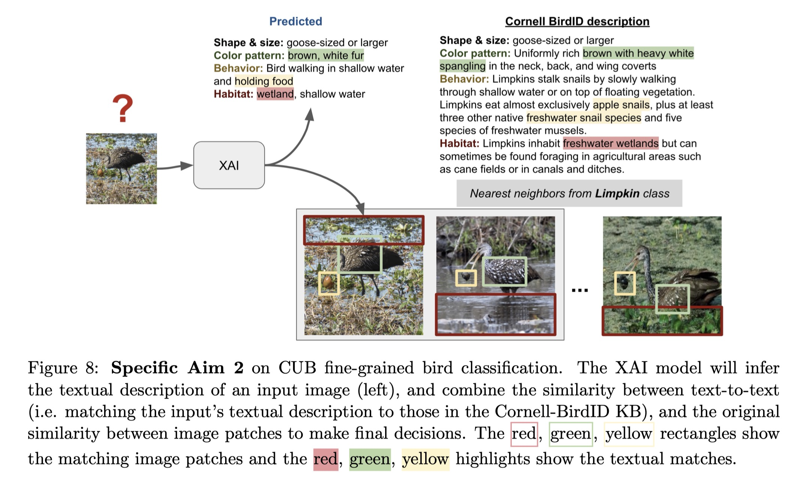

# reasoning
bird reasoning (size + habitat)



## Demo

```
python demo_image2text/run.py
```
## CNN based model
```
cd cnn_habitat_reaasoning/
```
### Train CUB
```
python cub_fintuning.py
```
### Train NABirds
```
python nabirds_fintuning.py
```

## CLIP

```
cd plain_clip/
```

### Run Zero-shot Classification
```
python main.py
```